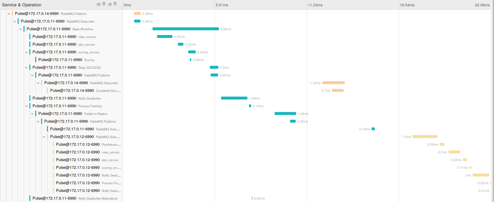

#Tracing Model

The project's API makes no assumption on the model used by it's implementation. However, the main OpenTracing based implementation relies on the Span model.

### Spans and Trees

The Span nodel is nothing more than a tree of nodes called Spans. Each Span is simply a small data structure that represents a fraction of the execution of any given request. This model was originally designed for distributed systems based on RPC, and as such the edges represented service-activation, however you can view them as the activation of a new service, method, fraction of code, etc.

#### Hierarchical Structure

Given that it's based on a tree, each trace will have a root Span that represents the beginning of a request's execution, think of this first span as the entry-point. Calls to other traced methods will become children of the root, calls from the children to other methods will become the children's children and so on. In the end a trace will resemble a distributed call tree that shows you the request path.

### Span Metadata

Spans contain a `traceID`, a `spanID` and `parentId` and key-value pairs called annotations. The annotations can be defined by the programmer, however there are two annotations which are present in every span: the start and end timestamp. This means that through tracing it is possible to view how long the request spent in each component.

### Visualization

The simplest way to view a trace is by looking at the span tree, however a Gantt Chart is the preferred visualization, as it shows both the causality relations between spans across time.
Below is an example of a Gantt Chart that represents the trace of a request in Pulse.

 

